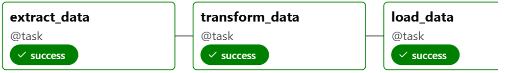
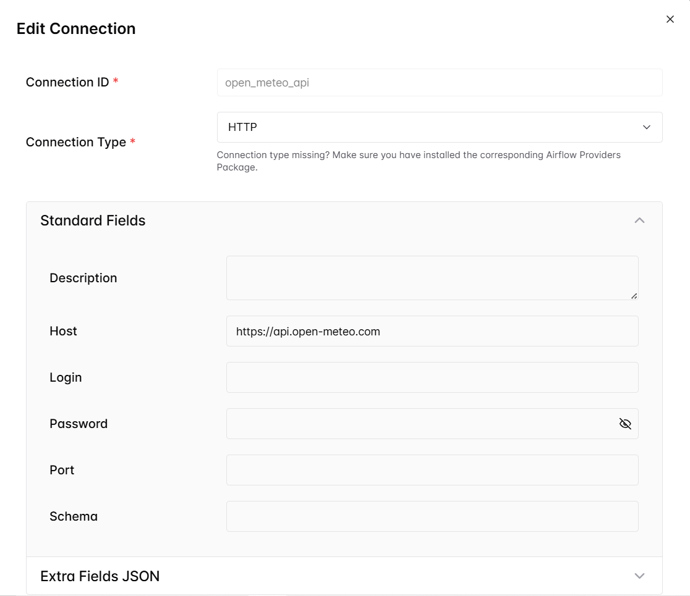
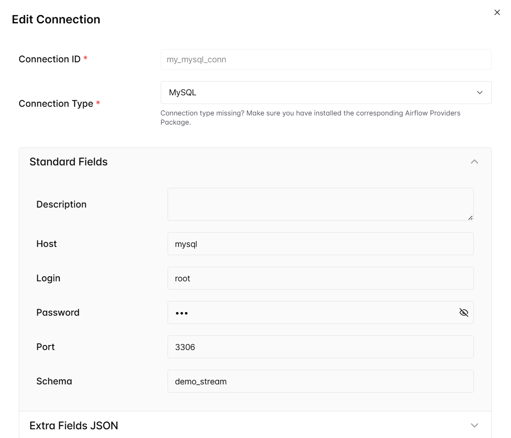

# 🌤️ Airflow DAG: Weather Data Pipeline (Bangkok)

## 🎯 Objective
This project demonstrates the development of a real-time data pipeline using **Apache Airflow**, designed to extract weather data from the **Open-Meteo API**, transform it, and load it into a **MySQL database**. The goal is to showcase orchestration, API integration, and structured data storage for downstream analytics and dashboarding.

The pipeline is scheduled to run daily, and targets weather data for Bangkok, Thailand.

## 📦 Project Overview

### ⚙️ Technologies Used
- Apache Airflow (Task orchestration)
- Open-Meteo API (Weather data source)
- MySQL (Data storage)
- Docker (Environment setup)
- Python (ETL logic)

### 🔁 DAG Flow
**1.  Extract**
    - Uses Airflow's HttpHook to call Open-Meteo API
    - Retrieves current weather data for Bangkok

**2.  Transform**
    - Parses and formats the JSON response
    - Extracts key fields: temperature, windspeed, wind direction, weather code

**3.  Load**
    - Connects to MySQL using Airflow's MySqlHook
    - Creates table weather_data if not exists
    - Inserts transformed data into the table



## 📂 Repository Structure
```
airflow-ETL-project/
│
├── dags/                          
│   ├── api_mysql_dag.py                # Airflow DAG for ETL pipeline
│ 
├── docker-compose.yaml                 # (Optional) for local Airflow + MySQL setup
│ 
├── docs/                               
│   ├── api-mysql-dag-graph.png         # data architecture
│   ├── http_conn.PNG                   # http airflow connection
│   ├── mysql_conn.PNG                  # mysql airflow connection
│   
└── README.md                           # Project overview
```

## 🧪 How to Run Locally

**1.  Start Airflow and MySQL containers using Docker Compose**

**2.  Configure Airflow Connections:**

- `open_meteo_api`: HTTP connection to https://api.open-meteo.com


- `my_mysql_conn`: MySQL connection pointing to MySQL



**3.  Start Airflow Webserver**

**4.  Trigger DAG manually or wait for daily schedule**
